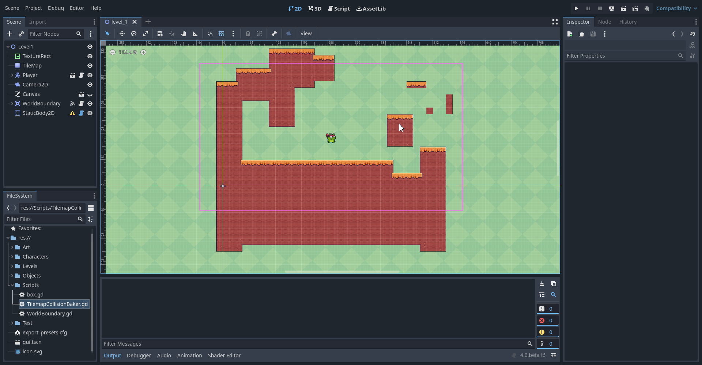

# Godot Tilemap Collision Baker

**Note: This script is for Godot 4, it may need some tinkering to work on Godot 3.x**
---
Godot Tilemap Baker is a tool to easily pre-bake collisions on square tilemaps. This can be useful for many reasons, the biggest one being that using the [default tileset collision can cause issues with rigidbodies](https://github.com/godotengine/godot/issues/72372) because objects tend to get stuck in-between tiles. TilemapBaker was built with this in mind, so floors and ceilings are always one smooth rectangle collider. It should also ^theoretically be more optimized because you end up with way less colliders.

## How to use
Simply attach the `TilemapCollisionBaker` script to an empty StaticBody2D, then point to your Tilemap in the inspector, and hit "Run Script". This is going to wrap your tileset with large box colliders, to be added as children to this node.

You can also select a specific tile layer to bake collisions for, which can be useful if you have slopes or water on separate layers for example.

Don't forget to remove your collisions from the tileset (if you ever had any) when using this tool.

Loved the project? [Consider buying me a cup of Ko-Fi!](https://ko-fi.com/popcar2)
